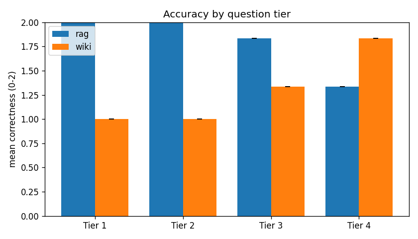
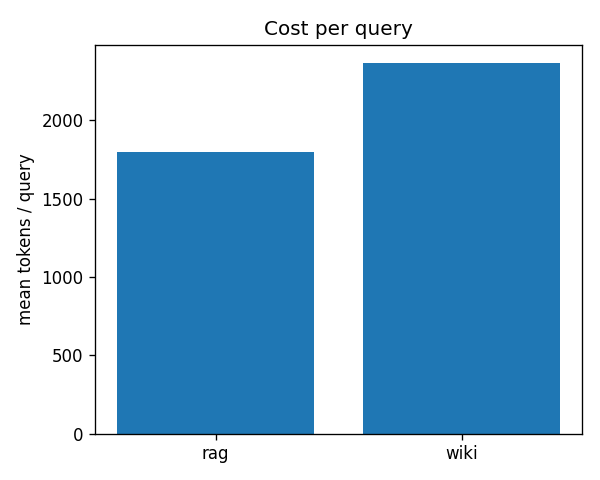
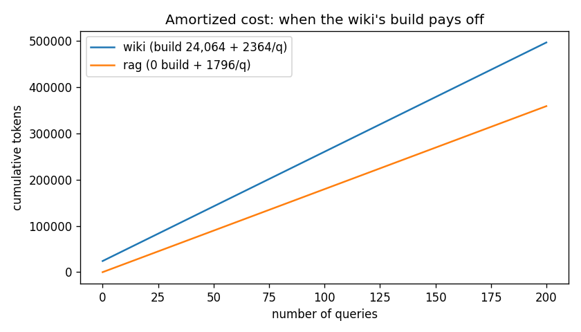

# Empirical_Study_on_WIKI_-_RAG — When does a compiled LLM wiki beat RAG?
A small benchmark comparing **vanilla RAG** against a compiled **LLM wiki**(introduced by Andrej Karpathy)
for question-answering over basic ML papers, with the generator model held constant.

**Headline finding:** on 4 papers with a local qwen3:8b, RAG significantly beat the wiki (overall 1.79 vs 1.29 on a 0-2 scale) and cost less per query;
the wiki won only on contradiction questions but failed on factual recall. See `reports/report.md`.
To investigate the whole result view the reports and results file deeply.

## The two systems
- **RAG** — chunk (220 words) -> MiniLM embeddings -> FAISS top-5 -> qwen3:8b answers.
- **Wiki** — qwen3:8b compiles `raw/` into linked markdown entity pages; a query reads `index.md`,
  opens the relevant pages, and answers from them.
- **Fairness controls:** same generator (qwen3:8b), same 24-question set, same 6,000-word budget
  per paper. A *another* model (llama3.1:8b) grades.

## Setup
    python -m venv .venv && .venv\Scripts\activate      # Windows
    pip install -r requirements.txt
    ollama pull qwen3:8b
    ollama pull llama3.1:8b

## Run
    python download_papers.py            # fetch the 4 papers into raw/
    python -m eval.run_eval              # compiles wiki + builds RAG index, then 24 Q x 2 systems x 3 -> results/metrics.csv
    python -m eval.judge                 # grades with llama3.1 -> results/metrics_graded.csv
    python -m eval.analyze               # tables + 3 charts -> results/summary.md, results/charts/
    python -m wiki_pipeline.validate     # chain-of-custody check -> results/custody_report.md
    python -m eval.handgrade make        # sample 10 answers to hand-grade; then: python -m eval.handgrade score

Tip: close `results/metrics.csv` in Excel before re-running, or it can't be overwritten.

## Results (v1)
| Tier | Wiki | RAG |
|---|---|---|
| 1 single fact | 1.00 | 2.00 |
| 2 single-doc reasoning | 1.00 | 2.00 |
| 3 multi-hop synthesis | 1.33 | 1.83 |
| 4 contradiction | 1.83 | 1.33 |
| **Overall** | **1.29** | **1.79** |

### Charts

**Accuracy by question tier** — the wiki (orange) only leads on Tier 4; it collapses on facts and reasoning.

**Tokens per query** — the wiki costs more per query (two model calls + whole-page context).

**Cumulative cost vs. number of queries** — because the wiki is pricier per query, its one-time build cost never pays off (no break-even).

Wiki 2,364 tokens/query vs RAG 1,796; wiki build cost 24,064 tokens (one-time).
Full write-up: `reports/report.md`. Error analysis: `eval/error_analysis.md`.

## Layout
    raw/            the 4 source papers
    wiki/           compiled entity pages (index.md, log.md, *.md)
    rag/            chunk + embed + FAISS index and query
    wiki_pipeline/  compile / lint / query / validate
    eval/           questions.yaml, run_eval, judge, analyze, handgrade
    results/        metrics.csv, metrics_graded.csv, summary.md, charts/
    reports/        report.md

## Limitations
Small single-domain study: 24 questions, 4 papers, 6,000-word cap, temperature 0 (near-zero
run-to-run variance), a single 8B judge. Directional evidence, not significance. See `reports/report.md`.

## Stack
Python, Ollama (qwen3:8b, llama3.1:8b), sentence-transformers, FAISS, PyMuPDF, pandas, matplotlib.
